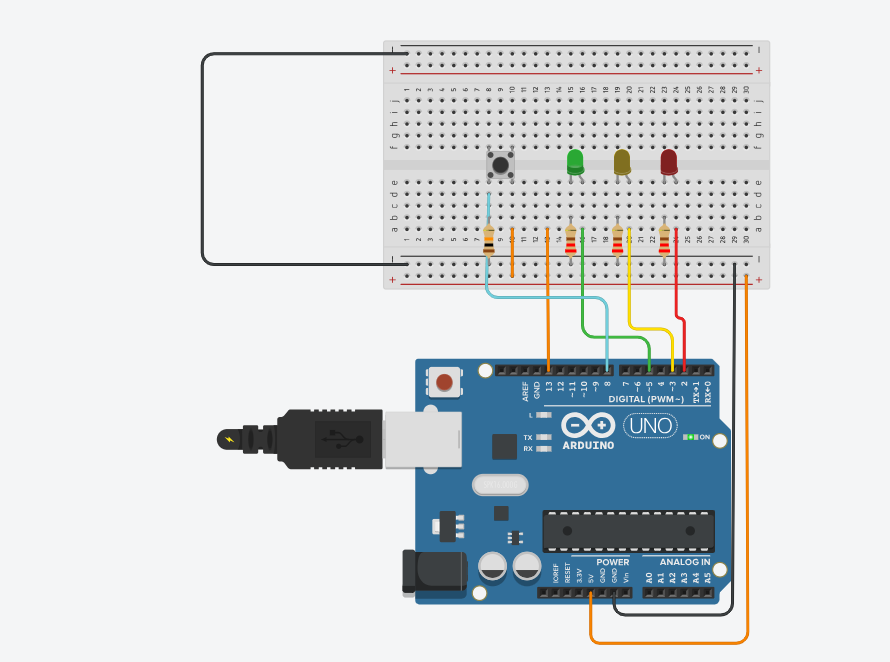

# ATIVIDADE SEMÁFORO ARDUINO

### Pedro Ribeiro, Luana e Clevison

---

### PRIMEIROS PASSOS:

- Antes de tudo foi definida a variável que receberá o valor da leitura do botão `digitalRead()`, na sequência verifica-se se o valor é igual a 1.
- Em seguida, foi definido o setup, onde foi declarado quais pinos seriam acionados com o valor "OUTPUT" ou "INPUT";  
  Sendo eles:
  - **2** - LED VERMELHO
  - **3** - LED AMARELO
  - **5** - LED VERDE

### CODIGOS LOOP:

- Primeiro foi colocado o comando `digitalWrite(5, HIGH)`, onde foi definido que o pino "5" receberia um sinal de 5V, ou seja, iniciaria aceso.  
  Depois foi colocado que a variável `valorBotao` recebesse o retorno do valor do `digitalRead(8)` - "8" é o botão, ou seja, ele recebe o valor após o clique do botão.  
  Foi verificado se o valor do botão é igual a "1", ou seja, se ele foi acionado. Se sim, emite o `digitalWrite(5, LOW)`, apaga o LED VERDE, acende o LED AMARELO com o comando `digitalWrite(3, HIGH)` com um delay de 1000ms. Ou seja, após um segundo ele desliga o LED AMARELO com o código `digitalWrite(3, LOW)`.  
  Por fim, o LED VERMELHO foi aceso através do comando `digitalWrite(2, HIGH)` e ficou ligado por 2000ms. Em seguida, executa o `digitalWrite(2, LOW)`.

### Imagem do Semáforo:

